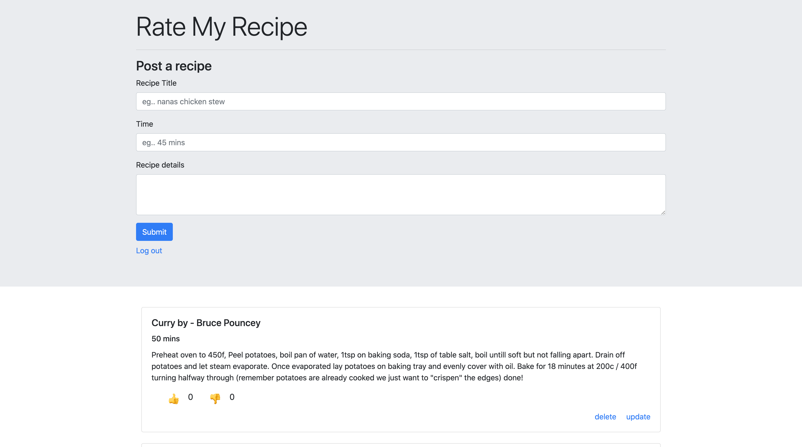

# Rate my recipes!
### [Rate my recipes](https://google.com) 


### Run locally
???

## Technologies used
* [MongoDB](https://www.mongodb.com/)
* [Expressjs](https://expressjs.com/)
* [Node](https://nodejs.org/)
* [Ejs](https://ejs.co/)
* [CSS3](https://css-tricks.com/)
* [Bootstrap](https://getbootstrap.com/)
* [OAuth 2.0](https://oauth.net/2/)

## Features
 * Secure OAuth authentication and authorization 
 * Add your recipes to the mongoDB atlas database
 * Upvote or downvote other users recipes
 * Learn cool new recipes from cool new people

## Model view controller methodology 
Creating a new mongoose schema and exporting as a model
```javascript
const mongoose = require('mongoose');
const newSchema = new mongoose.Schema({
  id: String,
  title: String,
}, {
  timestamps: true
});
module.exports = mongoose.model('NewSchema', newSchema);
```
Use ejs template tagging to dynamically change the views based on the data passed from the controller
```html
<!DOCTYPE html>
<html lang="en">
  <head>
    <meta charset="UTF-8">
    <title>Welcome</title>
  </head>
  <body>
    <div>
      <% if (user) { %>
      <a href="/logout">Log out</a>
      <% } else { %>
      <a href="/auth/google">Log In</a>
      <% } %>
    </div>
  </body>
</html>
```
Creat a controller to handle the data between the database and our .ejs views
```javascript
function index(req, res, next) {
  //Search for user based on query
  User.find(query)
    .sort(param).exec(function (err, users) {
      //Return all recipes from database
      Recipe.find({}, function (error, recipes) {
        //Pass user and recipes variables to our .ejs 'recipes'  view
        res.render('recipes', {
          users,
          recipes,
          user: req.user,
          name: req.query.name,
          sortKey
        });
      })
    })
}
```
Defining the route that uses our recipe controller index function  
```javascript
const recipeCtrl = require('../controllers/recipe')
router.get('/recipes', isLoggedIn, recipeCtrl.index);
```

## Environment
* macOS catalina: 10.15.3
* VS Code: 1.39.1

## Authors
* **Bruce Pouncey** - *Initial work* - [BPouncey](https://github.com/BPouncey)

## License
(MIT)

## Acknowledgments
[@GeneralAssembly](https://generalassemb.ly/)
